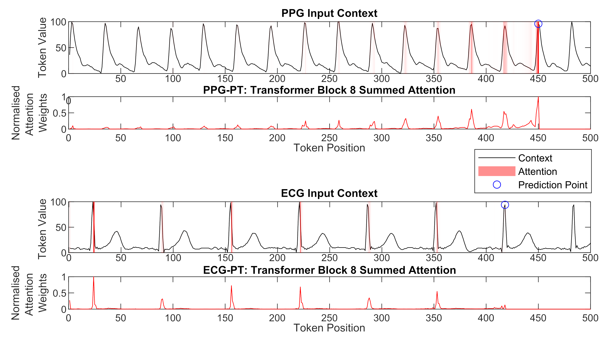
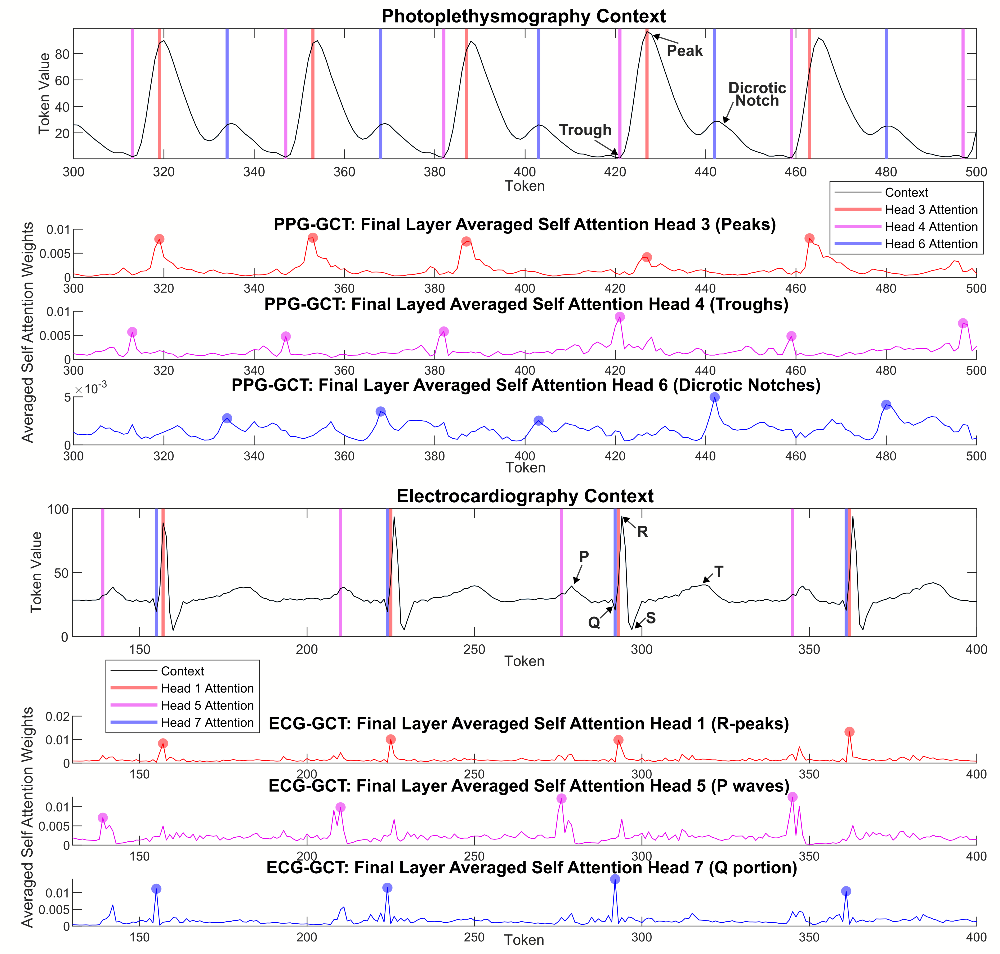

# HeartGPT
Interpretable Pre-Trained Transformers for Heart Time-Series Data: 
[Link to the paper](https://www.arxiv.org/abs/2407.20775)

In this work,  we apply the generative pre-trained transformer (GPT) framework to periodic heart time-series data to create two pre-trained general purpose cardiac models, namely PPG-PT and ECG-PT. A big enphasis of this work is on showing that the pre-trained models are fully interpretable, and that this interpretability carries over to fine-tuning tasks.   Finally, we highlight that It is also demonstrated that these pre-trained models can be easily fine-tuned for tasks such as classification of atrial fibrillation. In this specific example, the fine-tuning took 11 minutes of computer time, and achieved a leave-one-subject-out AUCs of 0.99 and 0.93 for ECG and PPG respectively. Importantly, these fine-tuned models are also fully explainable, with attention shifting to regions in the context that are strongly indicative of atrial fibrillation.

**Aggregate attention maps** show that the model focuses on similar points in previous cardiac cycles in order to make predictions and gradually broadens its attention in deeper layers:

Tokens with the same value (the time-series equivalent of a **homonym**) that occur at different distinct points in the ECG and PPG cycle form separate clusters in high dimensional space, based on their position in the cardiac cycle, as they are updated with the context of other tokens via the transformer blocks.

**Individual attention heads respond to specific physiologically relevent features**, such as the dicrotic notch in PPG and the P-wave in ECG.

This work was inspired by a [tutorial]https://github.com/karpathy/nanoGPT created by Andrej Karpathy.

# Fine-tuning example code will be added soon.

