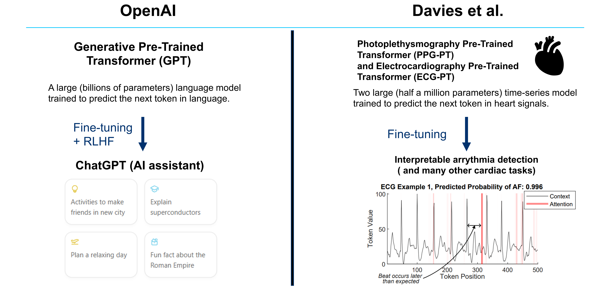
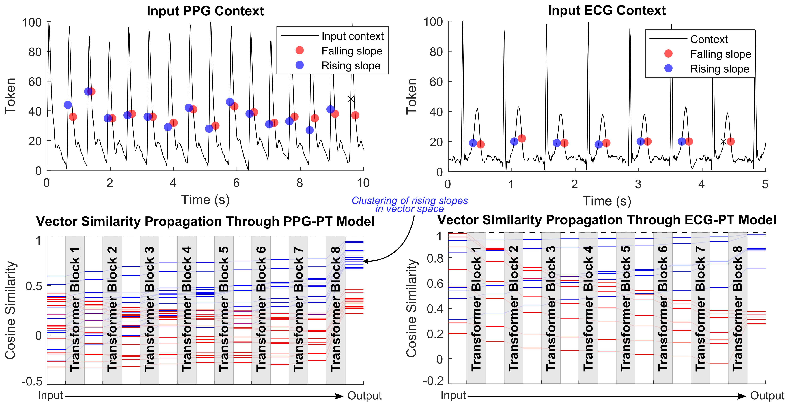
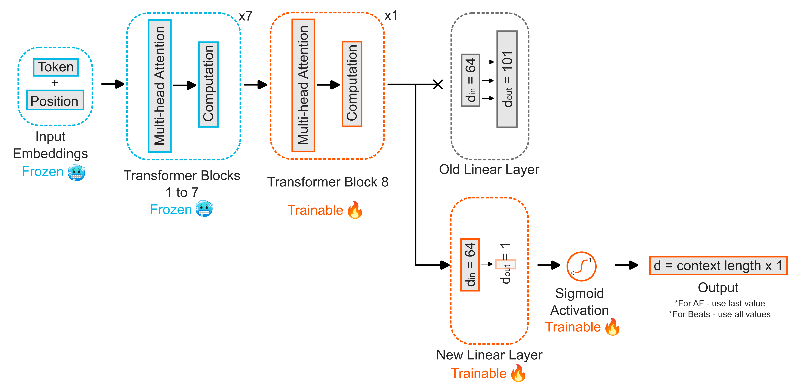

# HeartGPT
Interpretable Pre-Trained Transformers for Heart Time-Series Data: 
[Link to the paper](https://www.arxiv.org/abs/2407.20775)

17/09/2024 Update: A new GUI has been added. 
1. **Heart_GPT_GUI_interpretability_AF**, which automatically estimates beats of long finger PPG sequences, and gives a confidence level (signal quality). This currently does not work with wearables data with different morphologies, e.g ear and wrist. A new version is under development for this application.

11/09/2024 Update: A new GUI has been added. 
1. **Heart_GPT_GUI_interpretability_AF**, which gives a probability of AFib and reasoning (change in attention weights).

06/09/2024 Update: Two new GUIs have been added. 
1. **Heart_GPT_GUI_generation**, where you can load in context in the form of a csv, and the chosen model will generate in real time.
2. **Heart_GPT_GUI_interpretability**, where you can examine the attention weights for the base models for a given input context.

In this work,  we apply the generative pre-trained transformer (GPT) framework to periodic heart time-series data to create two pre-trained general purpose cardiac models, namely PPG-PT and ECG-PT. The models are capable of being fine-tuned for many different cardiac related tasks such as screening for arrythmias. A big enphasis of this work is on showing that the pre-trained models are fully interpretable, and that this interpretability carries over to fine-tuning tasks. The pre-trained transformers are interpretable in the following ways -

**Aggregate attention maps** show that the model focuses on similar points in previous cardiac cycles in order to make predictions and gradually broadens its attention in deeper layers:

Tokens with the same value (the time-series equivalent of a **homonym**) that occur at different distinct points in the ECG and PPG cycle form separate clusters in high dimensional space, based on their position in the cardiac cycle, as they are updated with the context of other tokens via the transformer blocks.

**Individual attention heads respond to specific physiologically relevent features**, such as the dicrotic notch in PPG and the P-wave in ECG.

This work was inspired by a [tutorial](https://github.com/karpathy/ng-video-lecture) created by Andrej Karpathy.

# Base code and model files:
**Heart_PT_generate.py** is a python script which loads in example contexts of either ECG or PPG, and uses the appropriate model to generate future time steps.

The pre-trained pytorch model files are in zip folders (**ECGPT_560k_iters** and **PPGPT_500k_iters**).

# Fine-tuning

An example adapted fine-tuning model definition is provided in **"Heart_PT_finetune.py"**, along with how to freeze different layers. 

